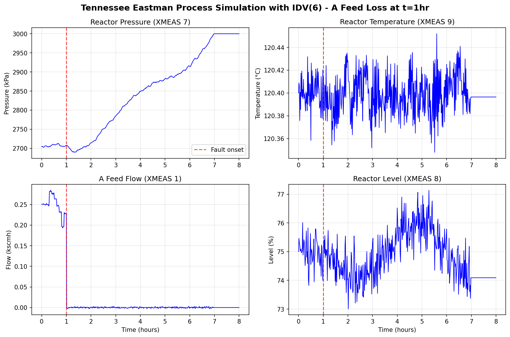

# Tennessee Eastman Process Simulator

[](https://github.com/jkitchin/tennessee-eastman-profbraatz/actions/workflows/tests.yml)
[](https://www.python.org/downloads/)
[](https://opensource.org/licenses/MIT)

A Python interface to the Tennessee Eastman Process (TEP) simulator using the original Fortran code via f2py for exact reproduction of simulation results.

Based on the original Fortran code by J.J. Downs and E.F. Vogel (1993), with modifications by E.L. Russell, L.H. Chiang, and R.D. Braatz.

Python wrapper developed with Claude Code by John Kitchin.

## Features

- **Complete TEP simulation** with all 50 state variables, 41 measurements, and 12 manipulated variables
- **20 process disturbances** (step changes, random variations, slow drift, valve sticking)
- **Multiple control modes**: Open-loop, closed-loop (decentralized PI), and manual
- **Real-time streaming interface** for dashboard integration
- **Interactive web dashboard** with live plotting and controls
- **Reproducible simulations** with seeded random number generation
- **Exact Fortran results** via f2py wrapper (requires gfortran)

## Example Output



*Simulation showing IDV(6) - A Feed Loss fault applied at t=1 hour. The A feed flow drops to zero, causing reactor pressure to rise as the controller compensates.*

## Quick Start

### Requirements

- Python 3.8+
- Fortran compiler (gfortran) - required for building the f2py extension
- NumPy

### Installation

```bash
# Basic installation (requires gfortran)
pip install -e .

# With GUI dashboard support
pip install -e ".[gui]"

# For development (includes pytest)
pip install -e ".[dev]"
```

**Note:** Installation requires a Fortran compiler. On macOS: `brew install gcc`. On Linux: `apt install gfortran`.

### Basic Usage

```python
from tep import TEPSimulator

# Create and initialize simulator
sim = TEPSimulator()
sim.initialize()

# Run a 1-hour simulation
result = sim.simulate(duration_hours=1.0)

# Access results
print(f"Simulation time: {result.time[-1]:.2f} hours")
print(f"Final reactor temperature: {result.measurements[-1, 8]:.1f} °C")
print(f"Final reactor pressure: {result.measurements[-1, 6]:.1f} kPa")
```

### With Disturbances

```python
from tep import TEPSimulator

sim = TEPSimulator()
sim.initialize()

# Apply disturbance IDV(1) at t=0.5 hours
result = sim.simulate(
    duration_hours=2.0,
    disturbances={1: (0.5, 1)}  # {disturbance_id: (time_hours, value)}
)
```

### Launch Web Dashboard

```bash
# From command line
tep-web

# With options
tep-web --no-browser --port 8080

# Or from Python
from tep.dashboard_dash import run_dashboard
run_dashboard()
```

The web dashboard provides:
- Real-time process visualization
- Interactive disturbance controls
- Manual valve manipulation
- Data export to CSV

## Documentation

- [API Reference](docs/api.md) - Detailed API documentation
- [Dashboard Guide](docs/dashboard.md) - Interactive GUI documentation
- [Examples](examples/) - Usage examples and tutorials

## Architecture

```
tep/
├── __init__.py          # Package exports
├── constants.py         # Physical constants, initial states, variable names
├── controllers.py       # PI controllers, decentralized control
├── fortran_backend.py   # f2py wrapper for Fortran TEINIT/TEFUNC
├── simulator.py         # High-level TEPSimulator interface
├── dashboard.py         # Interactive tkinter GUI dashboard
├── dashboard_dash.py    # Web-based Dash dashboard
└── _fortran/            # Compiled Fortran extension (built during install)
    └── teprob.cpython-*.so
```

The simulator uses the original Fortran code (`teprob.f`) via f2py, ensuring exact numerical parity with the published TEP benchmark.

## Process Overview

The Tennessee Eastman Process is a realistic simulation of an industrial chemical process with:

- **Reactor**: Exothermic reactions A→G, A→H, A+D→F, 3D→2F
- **Separator**: Product separation with cooling water
- **Stripper**: Steam-heated purification column
- **Compressor**: Recycle gas compression

### State Variables (50 total)

| Range | Description |
|-------|-------------|
| 1-3 | Reactor component moles (A, B, C) |
| 4-9 | Reactor component moles (D, E, F, G, H) + Separator liquid |
| 10-12 | Separator vapor moles |
| 13-17 | Stripper liquid moles |
| 18-30 | Various pressures, levels, temperatures |
| 31-36 | Compressor states |
| 37-50 | Analyzer delay states |

### Measurements (41 total)

| Variable | Description | Units |
|----------|-------------|-------|
| XMEAS(1-6) | Feed and recycle flows | kscmh, kg/hr |
| XMEAS(7-9) | Reactor pressure, level, temperature | kPa, %, °C |
| XMEAS(10-14) | Purge and separator | various |
| XMEAS(15-19) | Stripper measurements | various |
| XMEAS(20-22) | Utilities | kW, °C |
| XMEAS(23-28) | Reactor feed composition | mol% |
| XMEAS(29-36) | Purge gas composition | mol% |
| XMEAS(37-41) | Product composition | mol% |

### Manipulated Variables (12)

| Variable | Description |
|----------|-------------|
| XMV(1) | D Feed Flow |
| XMV(2) | E Feed Flow |
| XMV(3) | A Feed Flow |
| XMV(4) | A and C Feed Flow |
| XMV(5) | Compressor Recycle Valve |
| XMV(6) | Purge Valve |
| XMV(7) | Separator Liquid Flow |
| XMV(8) | Stripper Product Flow |
| XMV(9) | Stripper Steam Valve |
| XMV(10) | Reactor Cooling Water |
| XMV(11) | Condenser Cooling Water |
| XMV(12) | Agitator Speed |

### Disturbances (20)

| IDV | Type | Description |
|-----|------|-------------|
| 1-7 | Step | Feed composition, temperature changes |
| 8-12 | Random | Feed and cooling water variations |
| 13 | Drift | Reaction kinetics slow change |
| 14-15 | Sticking | Cooling water valve issues |
| 16-20 | Unknown | Reserved for testing |

## References

**Original Fortran Code:**
- J.J. Downs and E.F. Vogel, "A plant-wide industrial process control problem," *Computers and Chemical Engineering*, 17:245-255 (1993). [DOI](https://doi.org/10.1016/0098-1354(93)80018-I)

**Modified Closed-Loop Control:**
- E.L. Russell, L.H. Chiang, and R.D. Braatz, *Data-driven Techniques for Fault Detection and Diagnosis in Chemical Processes*, Springer-Verlag, London, 2000.
- L.H. Chiang, E.L. Russell, and R.D. Braatz, *Fault Detection and Diagnosis in Industrial Systems*, Springer-Verlag, London, 2001.

## License

This project is licensed under the MIT License - see the original copyright notices below.

---

# Original Fortran Documentation

The sections below document the original Fortran implementation.

## Contents

This directory contains the Fortran 77 codes for the open-loop and the closed-loop simulations for the Tennessee Eastman process (TEP) as well as the training and testing data files used for evaluating the data-driven methods (PCA, PLS, FDA, and CVA).

File name | Description
--------- | -----------
[`temain.f`](#temainf) | open loop simulation codes for the TEP
[`temain_mod.f`](#temainmodf) | closed loop simulation codes for the TEP
[`teprob.f`](#teprobf) | subprogram for the simulation codes for the TEP
`d00.dat` | training file for the normal operating conditions
`d00_te.dat` | testing file for the normal operating conditions
`d01.dat` | training file for Fault 1
`d01_te.dat`| testing file for Fault 1
`d02.dat` | training file for Fault 2
`d02_te.dat`| testing file for Fault 2
`d21.dat`|training file for Fault 21
`d21_te.dat`| testing file for Fault 21

Each training data file contains 480 rows and 52 columns and each testing data file contains 960 rows and 52 columns.
An observation vector at a particular time instant is given by
```fortran
 x = [XMEAS(1), XMEAS(2), ..., XMEAS(41), XMV(1), ..., XMV(11)]^T
```
where `XMEAS(n)`is the n-th measured variable and `XMV(n)` is the n-th manipulated variable.

---

## `temain.f`

Main program for demonstrating application of the **Tennessee Eastman Process Control Test Problem**.

> James J. Downs and Ernest F. Vogel
>
> Process and Control Systems Engineering
>
> Tennessee Eastman Company
>
> P.O. Box 511
>
> Kingsport, TN  37662

**Reference**

- *A Plant-Wide Industrial Process Control Problem*, Presented at the AIChE 1990 Annual Meeting Industrial Challenge Problems in Process Control, Paper #24a. Chicago, Illinois, November 14, 1990.
- [*A Plant-Wide Industrial Process Control Problem*, Computers and Chemical Engineering, Vol. 17, No. 3, pp. 245-255 (1993)](https://doi.org/10.1016/0098-1354(93)80018-I).

## `temain_mod.f`

Main program for demonstrating application of the modified Tennessee Eastman Process Control Test Problem.

This *new version* is a **closed-loop plant-wide control scheme** for the **Tennessee Eastman Process Control Test Problem**.
The modifications are by:

> Evan L. Russell, Leo H. Chiang and Richard D. Braatz
>
>  Large Scale Systems Research Laboratory
>
>  Department of Chemical Engineering
>
>  University of Illinois at Urbana-Champaign
>
>  600 South Mathews Avenue, Box C-3
>
>  Urbana, Illinois 61801
>
>  http://brahms.scs.uiuc.edu

Original codes of the **Tennessee Eastman Process Control Test Problem** written by:

> James J. Downs and Ernest F. Vogel
>
> Process and Control Systems Engineering
>
> Tennessee Eastman Company
>
> P.O. Box 511
>
> Kingsport, Tennessee 37662

### License

The modified text is Copyright 1998-2002 by The Board of Trustees of the University of Illinois. All rights reserved.

Permission hereby granted, free of charge, to any person obtaining a copy of this software and associated documentation files (the "Software"), to deal with the Software without restriction, including without limitation the rights to use, copy, modify, merge, publish, distribute, sublicense, and/or sell copies of the Software, and to permit persons to whom the Software is furnished to do so, subject to the following conditions:

1. Redistributions of source code must retain the above copyright notice, this list of conditions and the following disclaimers.
2. Redistributions in binary form must reproduce the above copyright notice, this list of conditions and the following disclaimers in the documentation and/or other materials provided with the distribution.
3. Neither the names of Large Scale Research Systems Laboratory, University of Illinois, nor the names of its contributors may be used to endorse or promote products derived from this Software without specific prior written permission.

THE SOFTWARE IS PROVIDED "AS IS", WITHOUT WARRANTY OF ANY KIND, EXPRESS OR IMPLIED, INCLUDING BUT NOT LIMITED TO THE WARRANTIES OF MERCHANTABILITY, FITNESS FOR A PARTICULAR PURPOSE AND NONINFRINGEMENT. IN NO EVENT SHALL THE CONTRIBUTORS OR COPYRIGHT HOLDERS BE LIABLE FOR ANY CLAIM, DAMAGES OR OTHER LIABILITY, WHETHER IN AN ACTION OF CONTRACT, TORT OR OTHERWISE, ARISING FROM, OUT OF OR IN CONNECTION WITH THE SOFTWARE OR THE USE OR OTHER DEALINGS IN THE SOFTWARE.

Users should cite the *original code* using the following references:

- J.J. Downs and E.F. Vogel, *A plant-wide industrial process control problem*. Presented at the AIChE 1990 Annual Meeting, Session on Industrial Challenge Problems in Process Control, Paper #24a Chicago, Illinois, November 14, 1990.
- [J.J. Downs and E.F. Vogel, *A plant-wide industrial process control problem*, Computers and Chemical Engineering, 17:245-255 (1993)](https://doi.org/10.1016/0098-1354(93)80018-I).

Users should cite the *modified code* using the following references:

- [E.L. Russell, L.H. Chiang, and R.D. Braatz. Data-driven Techniques for Fault Detection and Diagnosis in Chemical Processes, Springer-Verlag, London, 2000](https://doi.org/10.1007/978-1-4471-0409-4).
- [L.H. Chiang, E.L. Russell, and R.D. Braatz. Fault Detection and Diagnosis in Industrial Systems, Springer-Verlag, London, 2001](https://doi.org/10.1007/978-1-4471-0347-9).
- [L.H. Chiang, E.L. Russell, and R.D. Braatz. *Fault diagnosis in chemical processes using Fisher discriminant analysis, discriminant partial least squares, and principal component analysis*, Chemometrics and Intelligent Laboratory Systems, 50:243-252, 2000](https://doi.org/10.1016/S0169-7439(99)00061-1).
- [E.L. Russell, L.H. Chiang, and R.D. Braatz. *Fault detection in industrial processes using canonical variate analysis and dynamic principal component analysis*, Chemometrics and Intelligent Laboratory Systems, 51:81-93, 2000](https://doi.org/10.1016/S0169-7439(00)00058-7).

### Instructions for running the Fortran program

1. Go to line `220`, change `NPTS` to the number of data points to simulate. For each minute of operation, 60 points are generated.
2. Go to line `226`, change `SSPTS` to the number of data points to simulate in steady state operation before implementing the disturbance.
3. Go to line `367`, implement any of the 21 programmed disturbances. For example, to implement disturbance 2, type `IDV(2)=1`.
4. The program will generate 15 output files and all data are recorded every 180 seconds, see Table 1 for details.

	The default path is the home directory.	To change the file name and path, modify lines `346-360` accordingly.

	To overwrite the files that already existed, change `STATUS='new'` to `STATUS='old'` from lines `346-360`.

	**Table 1:** Content of the output files

    \#| File Name | Content
    --| --------- | -------
     1| `TE_data_inc.dat` | Time (in seconds)
     2| `TE_data_mv1.dat` | Measurements for manipulated variables 1 to 4
     3| `TE_data_mv2.dat` | Measurements for manipulated variables 5 to 8
     4| `TE_data_mv3.dat` | Measurements for manipulated variables 9 to 12
     5| `TE_data_me01.dat` | Measurements for measurement variables 1 to 4
     6| `TE_data_me02.dat` | Measurements for measurement variables 5 to 8
     7| `TE_data_me03.dat` | Measurements for measurement variables 9 to 12
     8| `TE_data_me04.dat` | Measurements for measurement variables 13 to 16
     9| `TE_data_me05.dat` | Measurements for measurement variables 17 to 20
    10| `TE_data_me06.dat` | Measurements for measurement variables 21 to 24
    11| `TE_data_me07.dat` | Measurements for measurement variables 25 to 28
    12| `TE_data_me08.dat` | Measurements for measurement variables 29 to 32
    13| `TE_data_me09.dat` | Measurements for measurement variables 33 to 36
    14| `TE_data_me10.dat` | Measurements for measurement variables 37 to 40
    15| `TE_data_me11.dat` | Measurements for measurement variable 41

5. To ensure the randomness of the measurement noises, the random number `G` in the sub program (`teprob.f`, line 1187) has to be changed each time before running `temain_mod.f`.
6. Save the changes in `temain_mod.f` and `teprob.f` and compile the program in unix by typing
	```bash
	  f77 temain_mod.f teprob.f
	```
7. Run the program by typing
	```bash
	  a.out
	```

## `teprob.f`

Revised 4-4-91 to correct error in documentation of manipulated variables

**Tennessee Eastman Process Control Test Problem**

> James J. Downs and Ernest F. Vogel
>
> Process and Control Systems Engineering
>
> Tennessee Eastman Company
>
> P.O. Box 511
>
> Kingsport, TN  37662

**Reference**

- A Plant-Wide Industrial Process Control Problem". Presented at the AIChE 1990 Annual Meeting Industrial Challenge Problems in Process Control, Paper #24a Chicago, Illinois, November 14, 1990.

### Subroutines

- `TEFUNC` - Function evaluator to be called by integrator
- `TEINIT` - Initialization
- `TESUBi` - Utility subroutines (i = 1, 2, ..., 8)

The process simulation has 50 states (`NN=50`).

If the user wishes to integrate additional states, `NN` must be increased accordingly in the calling program.

The additional states should be appended to the end of the `YY` vector, e.g. `YY(51), ...`. The additional derivatives should be appended to the end of the `YP` vector, e.g. `YP(51),...`.

To initialize the new states and to calculate derivatives for them, we suggest creating new function evaluator and initialization routines as follows.

```fortran
C-----------------------------------------------
C
      SUBROUTINE FUNC(NN,TIME,YY,YP)
C
      INTEGER NN
      DOUBLE PRECISION TIME, YY(NN), YP(NN)
C
C  Call the function evaluator for the process
C
      CALL TEFUNC(NN,TIME,YY,YP)
C
C  Calculate derivatives for additional states
C
      YP(51) = ....
      YP(52) = ....
         .
         .
         .
      YP(NN) = ....
C
      RETURN
      END
C
C-----------------------------------------------
C
      SUBROUTINE INIT(NN,TIME,YY,YP)
C
      INTEGER NN
      DOUBLE PRECISION TIME, YY(NN), YP(NN)
C
C  Call the initialization for the process
C
      CALL TEINIT(NN,TIME,YY,YP)
C
C  Initialize additional states
C
      YY(51) = ....
      YY(52) = ....
         .
         .
         .
      YY(NN) = ....
C
      RETURN
      END
C
C-----------------------------------------------
```

*Differences between the code and its description in the paper:*

1. Subroutine `TEINIT` has `TIME` in the argument list. `TEINIT` sets `TIME` to zero.
2. There are 8 utility subroutines (`TESUBi`) rather than 5.
3. Process disturbances 14 through 20 do *NOT* need to be used in conjunction with another disturbance as stated in the paper. All disturbances can be used alone or in any combination.

### Manipulated Variables (Fortran)

Variable | Description
-------- | -----------
`XMV(1)`  | D Feed Flow (stream 2)            (Corrected Order)
`XMV(2)`  | E Feed Flow (stream 3)            (Corrected Order)
`XMV(3)`  | A Feed Flow (stream 1)            (Corrected Order)
`XMV(4)`  | A and C Feed Flow (stream 4)
`XMV(5)`  | Compressor Recycle Valve
`XMV(6)`  | Purge Valve (stream 9)
`XMV(7)`  | Separator Pot Liquid Flow (stream 10)
`XMV(8)`  | Stripper Liquid Product Flow (stream 11)
`XMV(9)`  | Stripper Steam Valve
`XMV(10)` | Reactor Cooling Water Flow
`XMV(11)` | Condenser Cooling Water Flow
`XMV(12)` | Agitator Speed

### Continuous Process Measurements (Fortran)

Variable | Description | unit
-------- | ----------- | ----
`XMEAS(1)`  | A Feed  (stream 1)                  | kscmh
`XMEAS(2)`  | D Feed  (stream 2)                  | kg/hr
`XMEAS(3)`  | E Feed  (stream 3)                  | kg/hr
`XMEAS(4)`  | A and C Feed  (stream 4)            | kscmh
`XMEAS(5)`  | Recycle Flow  (stream 8)            | kscmh
`XMEAS(6)`  | Reactor Feed Rate  (stream 6)       | kscmh
`XMEAS(7)`  | Reactor Pressure                    | kPa gauge
`XMEAS(8)`  | Reactor Level                       | %
`XMEAS(9)`  | Reactor Temperature                 | Deg C
`XMEAS(10)` | Purge Rate (stream 9)               | kscmh
`XMEAS(11)` | Product Sep Temp                    | Deg C
`XMEAS(12)` | Product Sep Level                   | %
`XMEAS(13)` | Prod Sep Pressure                   | kPa gauge
`XMEAS(14)` | Prod Sep Underflow (stream 10)      | m3/hr
`XMEAS(15)` | Stripper Level                      | %
`XMEAS(16)` | Stripper Pressure                   | kPa gauge
`XMEAS(17)` | Stripper Underflow (stream 11)      | m3/hr
`XMEAS(18)` | Stripper Temperature                | Deg C
`XMEAS(19)` | Stripper Steam Flow                 | kg/hr
`XMEAS(20)` | Compressor Work                     | kW
`XMEAS(21)` | Reactor Cooling Water Outlet Temp   | Deg C
`XMEAS(22)` | Separator Cooling Water Outlet Temp | Deg C

### Sampled Process Measurements (Fortran)

- Reactor Feed Analysis (Stream 6)
  > - Sampling Frequency = 0.1 hr
  > - Dead Time = 0.1 hr
  > - Mole %


	Variable | Description
	-------- | -----------
	`XMEAS(23)` | Component A
	`XMEAS(24)` | Component B
	`XMEAS(25)` | Component C
	`XMEAS(26)` | Component D
	`XMEAS(27)` | Component E
	`XMEAS(28)` | Component F

- Purge Gas Analysis (Stream 9)
  > - Sampling Frequency = 0.1 hr
  > - Dead Time = 0.1 hr
  > - Mole %

	Variable | Description
	-------- | -----------
	`XMEAS(29)` | Component A
	`XMEAS(30)` | Component B
	`XMEAS(31)` | Component C
	`XMEAS(32)` | Component D
	`XMEAS(33)` | Component E
	`XMEAS(34)` | Component F
	`XMEAS(35)` | Component G
	`XMEAS(36)` | Component H

- Product Analysis (Stream 11)
  > - Sampling Frequency = 0.25 hr
  > - Dead Time = 0.25 hr
  > - Mole %

	Variable | Description
	-------- | -----------
	`XMEAS(37)` | Component D
	`XMEAS(38)` | Component E
	`XMEAS(39)` | Component F
	`XMEAS(40)` | Component G
	`XMEAS(41)` | Component H

### Process Disturbances (Fortran)

Variable | Description
-------- | -----------
`IDV(1)`  | A/C Feed Ratio, B Composition Constant (Stream 4)          Step
`IDV(2)`  | B Composition, A/C Ratio Constant (Stream 4)               Step
`IDV(3)`  | D Feed Temperature (Stream 2)                              Step
`IDV(4)`  | Reactor Cooling Water Inlet Temperature                    Step
`IDV(5)`  | Condenser Cooling Water Inlet Temperature                  Step
`IDV(6)`  | A Feed Loss (Stream 1)                                     Step
`IDV(7)`  | C Header Pressure Loss - Reduced Availability (Stream 4)   Step
`IDV(8)`  | A, B, C Feed Composition (Stream 4)            Random Variation
`IDV(9)`  | D Feed Temperature (Stream 2)                  Random Variation
`IDV(10)` | C Feed Temperature (Stream 4)                  Random Variation
`IDV(11)` | Reactor Cooling Water Inlet Temperature        Random Variation
`IDV(12)` | Condenser Cooling Water Inlet Temperature      Random Variation
`IDV(13)` | Reaction Kinetics                                    Slow Drift
`IDV(14)` | Reactor Cooling Water Valve                            Sticking
`IDV(15)` | Condenser Cooling Water Valve                          Sticking
`IDV(16)` | Unknown
`IDV(17)` | Unknown
`IDV(18)` | Unknown
`IDV(19)` | Unknown
`IDV(20)` | Unknown
